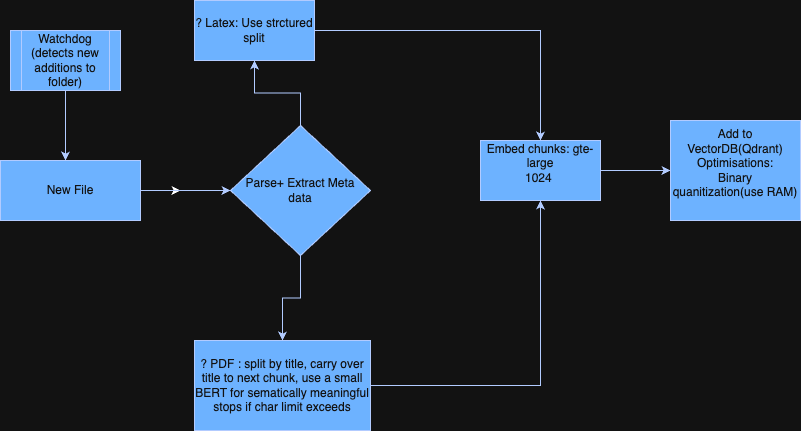

# Ingestion and Chunking Strategy

## Preliminary Decisions

I decided to use Qdrant as my vector DB of choice. Qdrant is easy to set up and used widely in production, so it was my first choice. Most people would immediate go for Pinecone but I used an open source alternative.

My next choice was the use of Qdrant Binary Quantisation (instead of the usual 32-bit float). Since it's safe to assume we will be dealing with LOTS of chunks and journals, binary quantisation will help us save a lot of space and improve performance and speed.

Since I would be using 1024 dimensions (gte-large embedding dimensions), it shouldn't degrade the accuracy of the retrieved data by much.

For the challenge, I used Binary Quantisation, but realistically I would rather use 8-bit or 16-bit.

I used gte-large as the embedding model as I am using Deepseek R1.

## Chunking Strategy

### Extract the Metadata

The following metadata is quite essential for each chunk:

```
id, title, section_title, authors, journal, publish_year, usage_count, attributes, link, doi
```

Assuming the paper is in LaTeX format, it's quite easy to use structured (/section, /sub-section, etc.) extraction to extract the metadata.

If the paper is in PDF format, we could use a combination of heuristic + BERT to extract the metadata.

### Implementation Details

With LaTeX, the structure makes it easy. If the max chunk length exceeds, we can carry over the section title to the next chunk and find a semantically meaningful stop point to end the chunk using a semantic distance method.

With PDF, we rely on heuristic split for paragraphs and titles and then we create proper chunks using a semantic distance method.

### Code Implementation

```python
def extract_metadata(doc, format):
    metadata = {}
    
    if format == "latex":
        metadata["title"] = extract_latex_title(doc)
        metadata["authors"] = extract_latex_authors(doc)
        metadata["journal"] = extract_latex_journal(doc)
        metadata["publish_year"] = extract_latex_year(doc)
        metadata["doi"] = extract_latex_doi(doc)
        metadata["link"] = extract_latex_link(doc)
        metadata["usage_count"] = get_usage_from_db(doc.id)
        metadata["attributes"] = extract_latex_keywords(doc)
    
    elif format == "pdf":
        text = pdf_to_text(doc)
        metadata = bert_based_metadata_extraction(text)
        metadata["usage_count"] = get_usage_from_db(doc.id)

    return metadata

def chunk_document(doc, format, max_tokens):
    chunks = []
    current_chunk = ""
    section_title = ""
    
    if format == "latex":
        sections = split_by_latex_structure(doc)  # /section, /subsection etc.
        for sec in sections:
            section_title = sec.title
            for para in sec.paragraphs:
                if len(current_chunk + para) > max_tokens:
                    end_idx = find_semantic_stop(current_chunk)
                    chunks.append({
                        "text": current_chunk[:end_idx],
                        "section_title": section_title
                    })
                    current_chunk = current_chunk[end_idx:]
                current_chunk += para

    elif format == "pdf":
        paras = heuristic_split(doc)
        for para in paras:
            if len(current_chunk + para) > max_tokens:
                end_idx = find_semantic_stop(current_chunk)
                chunks.append({
                    "text": current_chunk[:end_idx],
                    "section_title": guess_section_title(current_chunk)
                })
                current_chunk = current_chunk[end_idx:]
            current_chunk += para

    if current_chunk:
        chunks.append({
            "text": current_chunk,
            "section_title": section_title
        })
    
    return chunks

def process_document(doc, format):
    metadata = extract_metadata(doc, format)
    chunks = chunk_document(doc, format, max_tokens=500)
    
    # Attach metadata to each chunk
    for i, chunk in enumerate(chunks):
        chunk["id"] = f"{doc.id}_chunk_{i+1}"
        chunk.update(metadata)
    
    return chunks
```

## Process Flow

Here's a visual representation of the ingestion pipeline flow:


